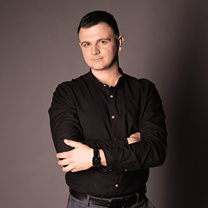

# Lozenko Roman



## Contact
* __E-mail:__ Lozenko.roman211@gmail.com
* __Phone:__ +375(44)726-39-96
* __Telegram:__ @Adamovich_r
* __Discord:__ Adamovich(@RomanAdamovich)
* __Location:__ Belarus Minsk

---
## Programming languages
* HTML
* CSS
* Basics JS
---
## Training:
* RS school stage0
---
## Target:
* Work in the field of IT
---
## About me
   I think that only actions and deeds can tell about what kind of person you are)) Describe yourself in hackneyed words like purposeful, stress-resistant, etc. anyone can, but life is different. I can only say that in my work I love it when the result is visible, when it is interesting, a good environment. Also in my free time I like to relax in nature, participate in outdoor sports, I love animals and of course my family. Now I want to enter IT to change my current field of activity. I study programming languages, as well as English. Thank you for visiting my page)))

---
## Сode example
```let num = 0;
while(num < 6){
  console.log(`вывод результата while ${num}`);
  num++;
};
```
---
## Education
* Belarusian-Russian University
* Faculty of Automotive Engineering
* Automobile Construction

---
## English
A1 (I am currently studying on my own)
